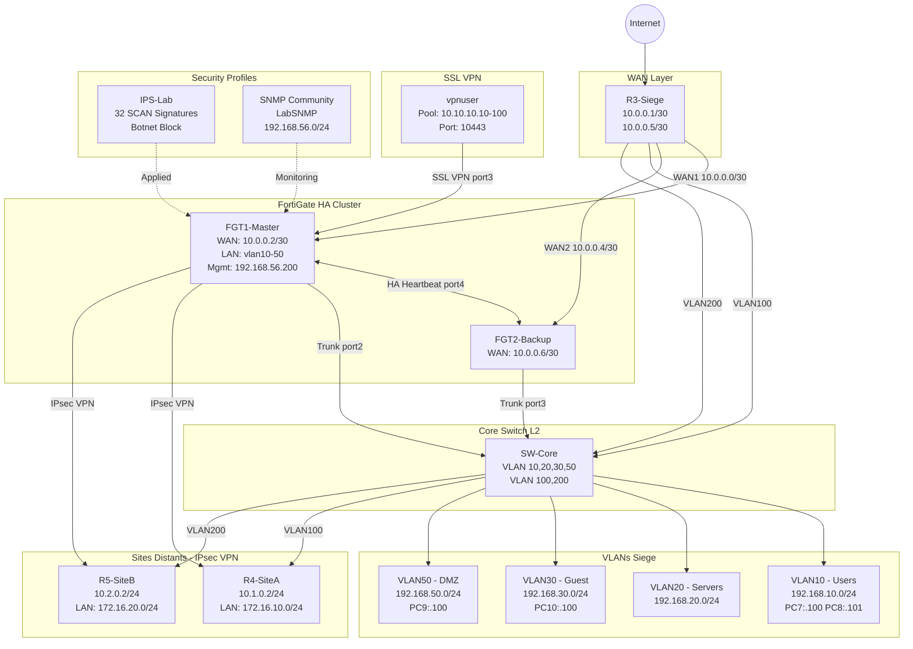

# Global Architecture Diagram

```mermaid
graph TB
    Internet((Internet))

    subgraph WAN["WAN Layer"]
        R3[R3-Siege\n10.0.0.1/30\n10.0.0.5/30]
    end

    subgraph HA["FortiGate HA Cluster"]
        FGT1[FGT1-Master\nWAN: 10.0.0.2/30\nLAN: vlan10-50\nMgmt: 192.168.56.200]
        FGT2[FGT2-Backup\nWAN: 10.0.0.6/30]
        FGT1 <-->|HA Heartbeat port4| FGT2
    end

    subgraph CORE["Core Switch L2"]
        SW[SW-Core\nVLAN 10,20,30,50\nVLAN 100,200]
    end

    subgraph VLANS["VLANs Siege"]
        VLAN10[VLAN10 - Users\n192.168.10.0/24\nPC7:.100 PC8:.101]
        VLAN20[VLAN20 - Servers\n192.168.20.0/24]
        VLAN30[VLAN30 - Guest\n192.168.30.0/24\nPC10:.100]
        VLAN50[VLAN50 - DMZ\n192.168.50.0/24\nPC9:.100]
    end

    subgraph SITES["Sites Distants - IPsec VPN"]
        R4[R4-SiteA\n10.1.0.2/24\nLAN: 172.16.10.0/24]
        R5[R5-SiteB\n10.2.0.2/24\nLAN: 172.16.20.0/24]
    end

    subgraph SSLVPN["SSL VPN"]
        VPNUSER[vpnuser\nPool: 10.10.10.10-100\nPort: 10443]
    end

    subgraph SECURITY["Security Profiles"]
        IPS[IPS-Lab\n32 SCAN Signatures\nBotnet Block]
        SNMP[SNMP Community\nLabSNMP\n192.168.56.0/24]
    end

    Internet --> R3
    R3 -->|WAN1 10.0.0.0/30| FGT1
    R3 -->|WAN2 10.0.0.4/30| FGT2
    R3 -->|VLAN100| SW
    R3 -->|VLAN200| SW
    FGT1 -->|Trunk port2| SW
    FGT2 -->|Trunk port3| SW
    SW --> VLAN10
    SW --> VLAN20
    SW --> VLAN30
    SW --> VLAN50
    SW -->|VLAN100| R4
    SW -->|VLAN200| R5
    FGT1 -->|IPsec VPN| R4
    FGT1 -->|IPsec VPN| R5
    VPNUSER -->|SSL VPN port3| FGT1
    IPS -.->|Applied| FGT1
    SNMP -.->|Monitoring| FGT1
```
