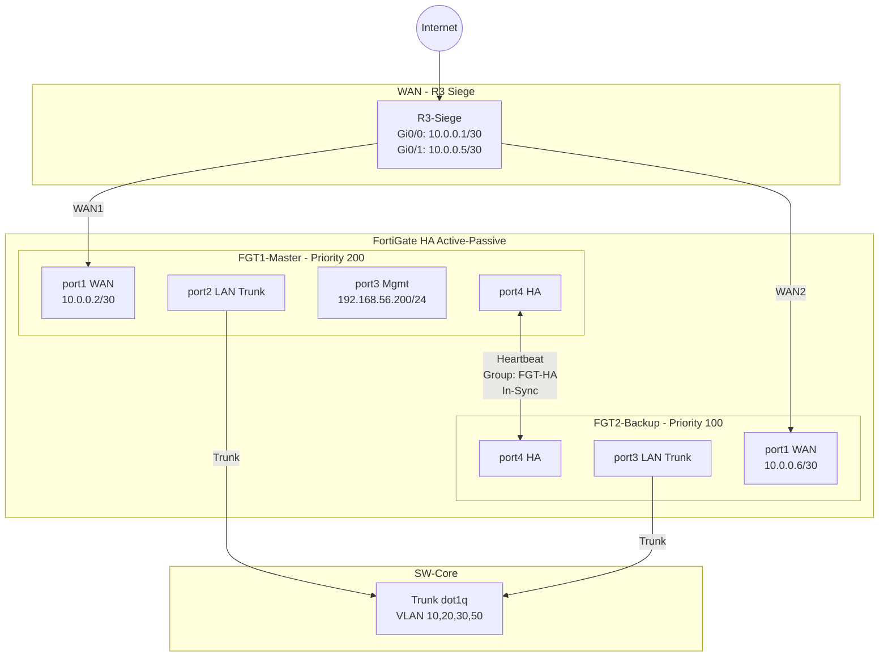

# FortiGate HA Architecture Diagram

```mermaid
graph TB
    Internet((Internet))

    subgraph WAN["WAN - R3 Siege"]
        R3[R3-Siege\nGi0/0: 10.0.0.1/30\nGi0/1: 10.0.0.5/30]
    end

    subgraph HA["FortiGate HA Active-Passive"]
        subgraph MASTER["FGT1-Master - Priority 200"]
            FGT1_WAN[port1 WAN\n10.0.0.2/30]
            FGT1_LAN[port2 LAN Trunk]
            FGT1_MGMT[port3 Mgmt\n192.168.56.200/24]
            FGT1_HA[port4 HA]
        end
        subgraph BACKUP["FGT2-Backup - Priority 100"]
            FGT2_WAN[port1 WAN\n10.0.0.6/30]
            FGT2_LAN[port3 LAN Trunk]
            FGT2_HA[port4 HA]
        end
        FGT1_HA <-->|Heartbeat\nGroup: FGT-HA\nIn-Sync| FGT2_HA
    end

    subgraph SW["SW-Core"]
        TRUNK[Trunk dot1q\nVLAN 10,20,30,50]
    end

    Internet --> R3
    R3 -->|WAN1| FGT1_WAN
    R3 -->|WAN2| FGT2_WAN
    FGT1_LAN -->|Trunk| TRUNK
    FGT2_LAN -->|Trunk| TRUNK
```
