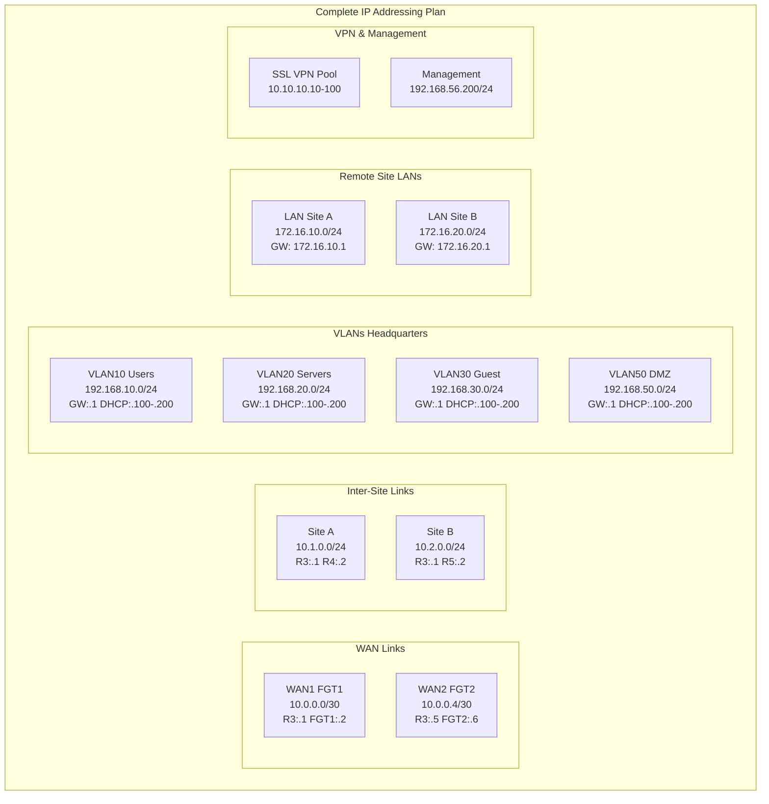

# IP Addressing Plan Diagram

```mermaid
graph TB
    subgraph PLAN["Complete IP Addressing Plan"]
        subgraph WAN_LINKS["WAN Links"]
            WAN1[WAN1 FGT1\n10.0.0.0/30\nR3:.1 FGT1:.2]
            WAN2[WAN2 FGT2\n10.0.0.4/30\nR3:.5 FGT2:.6]
        end

        subgraph INTER["Inter-Site Links"]
            SITEA_LINK[Site A\n10.1.0.0/24\nR3:.1 R4:.2]
            SITEB_LINK[Site B\n10.2.0.0/24\nR3:.1 R5:.2]
        end

        subgraph VLANS_IP["VLANs Headquarters"]
            V10[VLAN10 Users\n192.168.10.0/24\nGW:.1 DHCP:.100-.200]
            V20[VLAN20 Servers\n192.168.20.0/24\nGW:.1 DHCP:.100-.200]
            V30[VLAN30 Guest\n192.168.30.0/24\nGW:.1 DHCP:.100-.200]
            V50[VLAN50 DMZ\n192.168.50.0/24\nGW:.1 DHCP:.100-.200]
        end

        subgraph REMOTE_LAN["Remote Site LANs"]
            LANA[LAN Site A\n172.16.10.0/24\nGW: 172.16.10.1]
            LANB[LAN Site B\n172.16.20.0/24\nGW: 172.16.20.1]
        end

        subgraph VPN_POOL["VPN & Management"]
            SSLPOOL[SSL VPN Pool\n10.10.10.10-100]
            MGMT[Management\n192.168.56.200/24]
        end
    end
```
