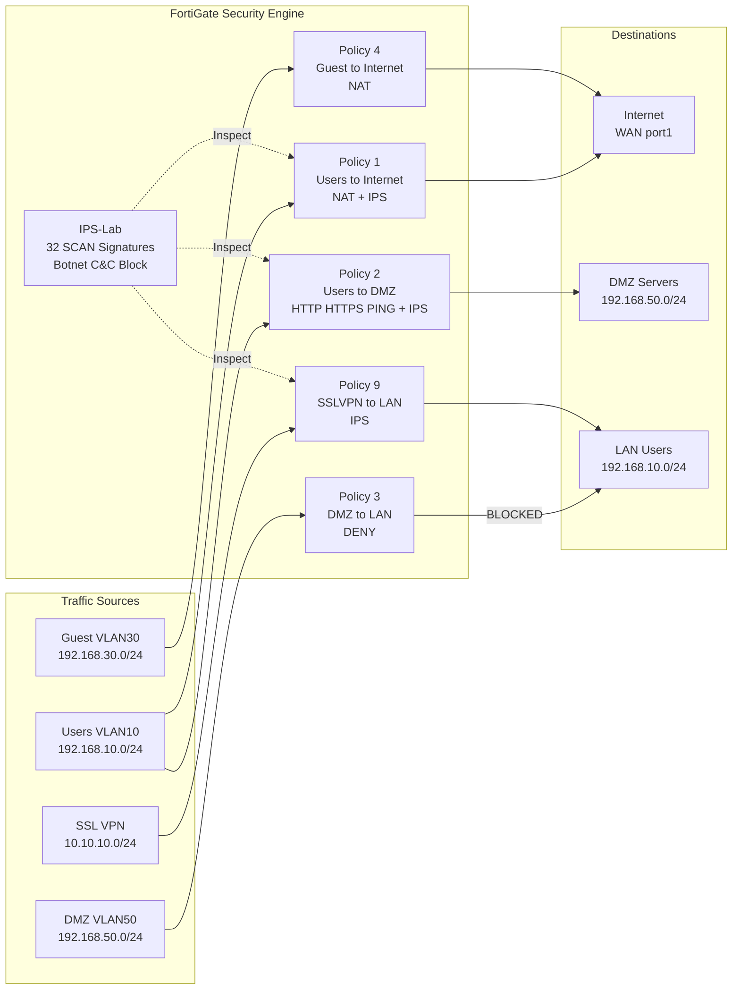

# Security Traffic Flow Diagram

```mermaid
graph LR
    subgraph SOURCES["Traffic Sources"]
        USERS[Users VLAN10\n192.168.10.0/24]
        GUEST[Guest VLAN30\n192.168.30.0/24]
        DMZ[DMZ VLAN50\n192.168.50.0/24]
        VPN[SSL VPN\n10.10.10.0/24]
    end

    subgraph FGT["FortiGate Security Engine"]
        IPS[IPS-Lab\n32 SCAN Signatures\nBotnet C&C Block]
        POL1[Policy 1\nUsers to Internet\nNAT + IPS]
        POL2[Policy 2\nUsers to DMZ\nHTTP HTTPS PING + IPS]
        POL3[Policy 3\nDMZ to LAN\nDENY]
        POL4[Policy 4\nGuest to Internet\nNAT]
        POL9[Policy 9\nSSLVPN to LAN\nIPS]
    end

    subgraph DEST["Destinations"]
        WAN[Internet\nWAN port1]
        DMZDST[DMZ Servers\n192.168.50.0/24]
        LAN[LAN Users\n192.168.10.0/24]
    end

    USERS --> POL1 --> WAN
    USERS --> POL2 --> DMZDST
    DMZ --> POL3 -->|BLOCKED| LAN
    GUEST --> POL4 --> WAN
    VPN --> POL9 --> LAN
    IPS -.->|Inspect| POL1
    IPS -.->|Inspect| POL2
    IPS -.->|Inspect| POL9
```
