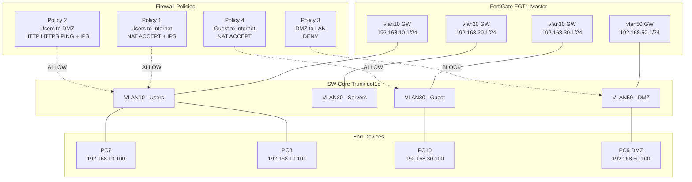

# VLAN Segmentation Diagram

```mermaid
graph TB
    subgraph FGT["FortiGate FGT1-Master"]
        GW10[vlan10 GW\n192.168.10.1/24]
        GW20[vlan20 GW\n192.168.20.1/24]
        GW30[vlan30 GW\n192.168.30.1/24]
        GW50[vlan50 GW\n192.168.50.1/24]
    end

    subgraph SW["SW-Core Trunk dot1q"]
        VLAN10[VLAN10 - Users]
        VLAN20[VLAN20 - Servers]
        VLAN30[VLAN30 - Guest]
        VLAN50[VLAN50 - DMZ]
    end

    subgraph HOSTS["End Devices"]
        PC7[PC7\n192.168.10.100]
        PC8[PC8\n192.168.10.101]
        PC10[PC10\n192.168.30.100]
        PC9[PC9 DMZ\n192.168.50.100]
    end

    subgraph POLICIES["Firewall Policies"]
        P1[Policy 1\nUsers to Internet\nNAT ACCEPT + IPS]
        P2[Policy 2\nUsers to DMZ\nHTTP HTTPS PING + IPS]
        P3[Policy 3\nDMZ to LAN\nDENY]
        P4[Policy 4\nGuest to Internet\nNAT ACCEPT]
    end

    GW10 --- VLAN10
    GW20 --- VLAN20
    GW30 --- VLAN30
    GW50 --- VLAN50
    VLAN10 --- PC7
    VLAN10 --- PC8
    VLAN30 --- PC10
    VLAN50 --- PC9
    P1 -.->|ALLOW| VLAN10
    P2 -.->|ALLOW| VLAN10
    P3 -.->|BLOCK| VLAN50
    P4 -.->|ALLOW| VLAN30
```
