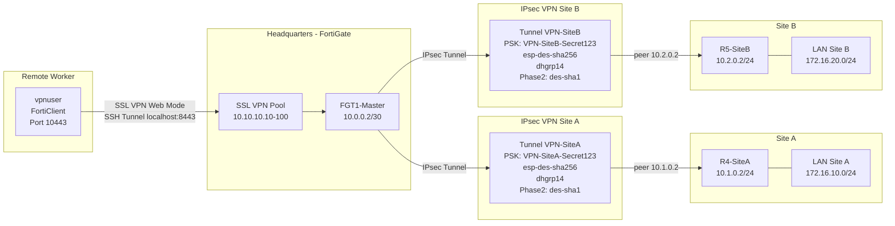

# VPN Architecture Diagram

```mermaid
graph LR
    subgraph SIEGE["Headquarters - FortiGate"]
        FGT1[FGT1-Master\n10.0.0.2/30]
        SSLPOOL[SSL VPN Pool\n10.10.10.10-100]
    end

    subgraph SITEA["Site A"]
        R4[R4-SiteA\n10.1.0.2/24]
        LANA[LAN Site A\n172.16.10.0/24]
    end

    subgraph SITEB["Site B"]
        R5[R5-SiteB\n10.2.0.2/24]
        LANB[LAN Site B\n172.16.20.0/24]
    end

    subgraph REMOTE["Remote Worker"]
        VPNUSER[vpnuser\nFortiClient\nPort 10443]
    end

    subgraph IPSEC_A["IPsec VPN Site A"]
        TUNNA[Tunnel VPN-SiteA\nPSK: VPN-SiteA-Secret123\nesp-des-sha256\ndhgrp14\nPhase2: des-sha1]
    end

    subgraph IPSEC_B["IPsec VPN Site B"]
        TUNNB[Tunnel VPN-SiteB\nPSK: VPN-SiteB-Secret123\nesp-des-sha256\ndhgrp14\nPhase2: des-sha1]
    end

    FGT1 -->|IPsec Tunnel| TUNNA
    TUNNA -->|peer 10.1.0.2| R4
    R4 --- LANA
    FGT1 -->|IPsec Tunnel| TUNNB
    TUNNB -->|peer 10.2.0.2| R5
    R5 --- LANB
    VPNUSER -->|SSL VPN Web Mode\nSSH Tunnel localhost:8443| SSLPOOL
    SSLPOOL --> FGT1
```
